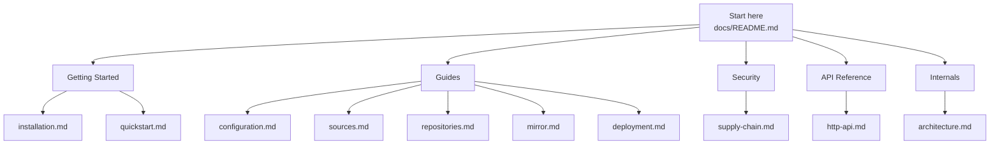
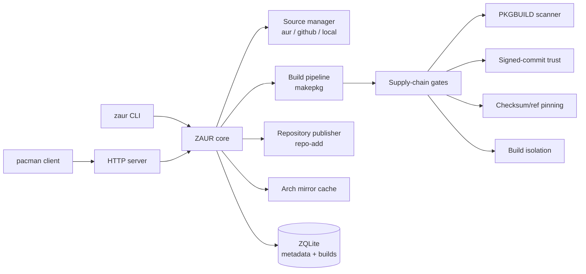
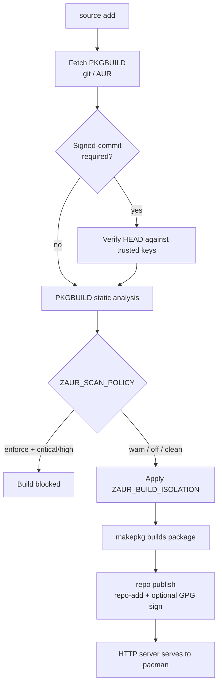

# ZAUR Documentation

ZAUR is a Zig-native AUR package builder and pacman repository server for Arch
Linux. It builds packages from AUR, GitHub, and local sources, publishes
pacman-compatible repositories, optionally mirrors official Arch repositories,
and applies supply-chain security gates around the build pipeline.

## Documentation Map

## Runtime Shape

## Build Pipeline Flow

## Getting Started

- [Installation](getting-started/installation.md) - Build from source, install the binary, and run as a systemd service.
- [Quickstart](getting-started/quickstart.md) - Initialize, add a source, build, publish, and serve locally.

## Guides

- [Configuration](guides/configuration.md) - Environment variables, data directories, and repository naming.
- [Sources](guides/sources.md) - AUR, GitHub, and local sources, plus generated PKGBUILDs for Zig and Rust projects.
- [Repositories](guides/repositories.md) - Publishing pacman databases, client configuration, and GPG signing.
- [Mirror](guides/mirror.md) - Caching official Arch repositories in metadata or on-demand mode.
- [Deployment](guides/deployment.md) - Docker Compose, nginx reverse proxy, and domain routing.

## Security

- [Supply-Chain Hardening](security/supply-chain.md) - PKGBUILD scanning, checksum/ref pinning, signed-commit trust, key management, and build isolation.

## API Reference

- [HTTP API](api/http-api.md) - Endpoints, authentication, and request requirements.

## Internals

- [Architecture](internals/architecture.md) - Module graph, build/request flows, and the supply-chain gate boundary.

## Quick Links

| Area | Path |
|------|------|
| Package metadata | [`../build.zig.zon`](../build.zig.zon) |
| Build script | [`../build.zig`](../build.zig) |
| Library exports | [`../src/root.zig`](../src/root.zig) |
| CLI entry point | [`../src/main.zig`](../src/main.zig) |
| Release notes | [`../CHANGELOG.md`](../CHANGELOG.md) |
| Security policy | [`../SECURITY.md`](../SECURITY.md) |
| Contributing | [`../CONTRIBUTING.md`](../CONTRIBUTING.md) |
