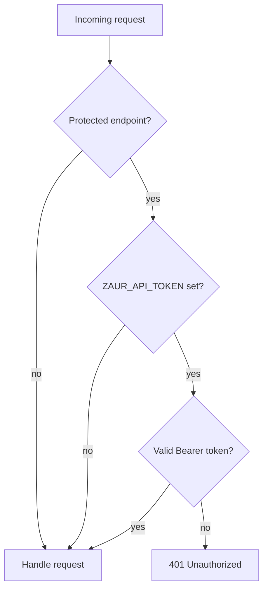

# HTTP API

The `zaur serve` command exposes a REST API and serves repository and mirror
files. The server binds to `127.0.0.1:9004` by default (`ZAUR_BIND`,
`ZAUR_PORT`).

## Authorization



When `ZAUR_API_TOKEN` is set, protected (write) endpoints require an
`Authorization: Bearer <token>` header. When it is unset, those endpoints are
open — only expose the server on a trusted network in that case.

## Endpoints

| Method | Path | Auth | Description |
|--------|------|------|-------------|
| GET | `/api/health` | public | Health check and version |
| GET | `/api/status` | public | System status |
| GET | `/api/packages` | public | List packages |
| GET | `/api/sources` | public | List sources |
| POST | `/api/sources` | protected | Add a source |
| DELETE | `/api/sources` | protected | Remove a source |
| GET | `/api/builds` | public | Build info |
| POST | `/api/builds` | protected | Trigger a build |
| GET | `/api/repos` | public | Repository info |
| POST | `/api/repos/publish` | protected | Regenerate repository databases |
| GET | `/api/mirror` | public | Mirror status (upstream, policy, cache) |
| POST | `/api/mirror/sync` | protected | Trigger a mirror sync |
| GET | `/api/security/findings` | public | PKGBUILD scan findings |
| POST | `/api/security/scan-pkgbuild` | protected | Scan a source's PKGBUILD |
| GET | `/api/security/keys` | protected | List trusted GPG fingerprints |
| POST | `/api/security/keys` | protected | Trust a GPG fingerprint |
| DELETE | `/api/security/keys` | protected | Untrust a GPG fingerprint |
| POST | `/api/security/pin` | protected | Pin a source to a ref/commit |

File serving (public): `/aur/*`, `/custom/*`, and `/mirror/$repo/os/$arch/$file`.

## Request Requirements

Protected write endpoints require:

- `Content-Type: application/json` (returns `415` if missing)
- a valid JSON body (returns `400` on malformed JSON)
- explicit intent in the body (for example `{"all":true}` to build all, not an
  empty body)

## Examples

```bash
# Public
curl http://localhost:9004/api/health
curl http://localhost:9004/api/status

# Protected (token configured)
curl -X POST http://localhost:9004/api/repos/publish \
  -H "Authorization: Bearer $ZAUR_API_TOKEN" \
  -H "Content-Type: application/json" \
  -d '{}'

curl -X POST http://localhost:9004/api/builds \
  -H "Authorization: Bearer $ZAUR_API_TOKEN" \
  -H "Content-Type: application/json" \
  -d '{"all":true}'
```

## CORS

Set `ZAUR_CORS_ORIGIN` to emit CORS headers for that origin. When unset, no CORS
headers are sent.
