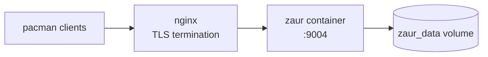

# Deployment

This covers running ZAUR with Docker Compose behind an nginx reverse proxy.

## Topology



## Docker Compose

```bash
cd docker/prod

# Build (host networking is needed for package downloads)
docker build --network=host -t zaur:latest -f Dockerfile ../..

# Start / logs / stop
docker compose up -d
docker compose logs -f
docker compose down
```

The `deploy.sh` helper wraps these steps:
`./deploy.sh up|down|logs|shell|status|rebuild`.

### Repository Docker Layout

```text
docker/
├── Dockerfile          # Local/test image (Arch + Zig dev, valgrind, gnupg)
├── compose.yml         # Local/test compose (host networking)
├── run-tests.sh        # Test runner: basic|full|build|memory|security|all|shell
├── scripts/            # build.sh, test.sh, test-full.sh, test-memory.sh, test-security.sh
└── prod/
    ├── Dockerfile      # Multi-stage release build
    ├── compose.yml     # Production compose file
    └── deploy.sh       # up/down/logs/shell/status/rebuild helper
```

## Local Test Suites

```bash
cd docker
./run-tests.sh basic      # CLI lifecycle smoke test
./run-tests.sh full       # HTTP/API integration suite
./run-tests.sh security   # scanner, pinning, key trust, API routes
./run-tests.sh memory     # Valgrind leak audit
./run-tests.sh all        # everything
```

The runner mounts the host Zig dev toolchain from `/opt/zig-dev` (override with
`ZIG_HOST_DIR=/path/to/zig`).

## nginx Reverse Proxy

Copy the provided config into `conf.d`, supply the referenced certificate, and
reload:

```bash
sudo cp docker/prod/zaur.conf /etc/nginx/conf.d/zaur.conf
sudo nginx -t && sudo systemctl reload nginx
```

## Domain Routing

Each subdomain root maps directly to a ZAUR repository path:

| Domain | ZAUR path | Purpose |
|--------|-----------|---------|
| `aur.example.io` | `/aur/` | AUR-built packages |
| `pkg.example.io` | `/custom/` | Custom packages |
| `mirror.example.io` | `/mirror/` | Arch repo metadata (databases) |

## Client Configuration

```ini
[aur]
SigLevel = Optional TrustAll
Server = https://aur.example.io

[custom]
SigLevel = Optional TrustAll
Server = https://pkg.example.io
```

With repo-database signing enabled, clients can use `SigLevel = Required` after
importing the signing key. See [Repositories](repositories.md#gpg-signed-databases).

## Persistent Data

The `zaur_data` volume persists repositories, source checkouts, build
workspaces, the mirror cache, and the database under `/var/lib/zaur`.

## Health Check

```bash
curl http://localhost:9004/api/health
# {"status":"ok","version":"<current version>"}
```

## Troubleshooting

| Symptom | Command |
|---------|---------|
| Container won't start | `docker compose logs zaur` |
| Build failures | `docker exec -it zaur zaur build logs <package>` |
| Reset everything | `docker compose down -v && docker compose up -d` |
