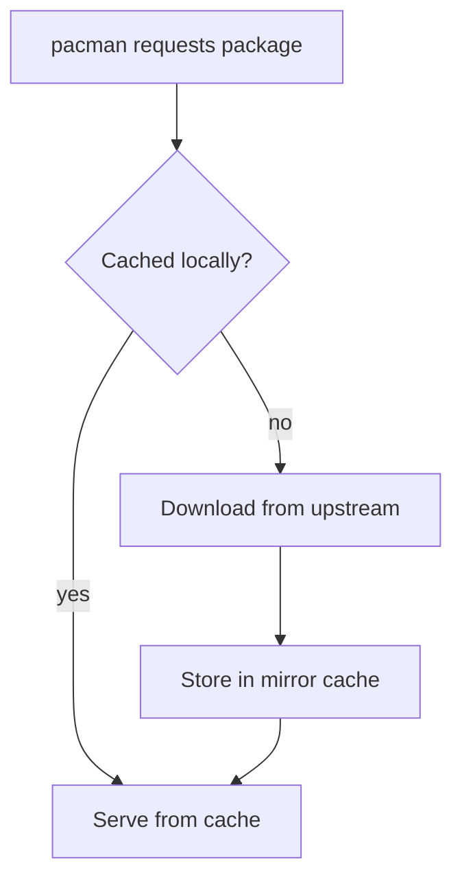

# Mirror

ZAUR can act as a caching proxy for official Arch Linux repositories (core,
extra, multilib), serving as a local mirror.

## Caching Modes

| Mode | Description | Use case |
|------|-------------|----------|
| `metadata` | Syncs database files only | Low bandwidth; package search/metadata only |
| `ondemand` | Downloads packages when first requested, then caches | Caching proxy for a local network |

## On-Demand Request Flow



## Configuration

| Variable | Default | Description |
|----------|---------|-------------|
| `ZAUR_MIRROR_ROOT` | `.zaur/mirror` | Local storage directory |
| `ZAUR_MIRROR_UPSTREAM` | `https://mirrors.kernel.org/archlinux` | Upstream mirror URL |
| `ZAUR_MIRROR_POLICY` | `metadata` | Caching policy: `metadata` or `ondemand` |

Pick an upstream close to you from the
[Arch mirrorlist](https://archlinux.org/mirrorlist/).

## Commands

```bash
zaur mirror status        # upstream, policy, and per-repo stats
zaur mirror sync [repo]   # sync all repos, or a named one
zaur mirror smart-sync    # databases only (recommended)
zaur mirror verify        # verify mirror files
zaur mirror auto-update   # check for and apply updates
```

The `sync`, `smart-sync`, and `auto-update` aliases are also accepted without
the `mirror` prefix.

## pacman Configuration

Replace the `[core]`, `[extra]`, and `[multilib]` sections in
`/etc/pacman.conf`:

```ini
[core]
SigLevel = Required DatabaseOptional TrustedOnly
Server = http://localhost:9004/mirror/$repo/os/$arch

[extra]
SigLevel = Required DatabaseOptional TrustedOnly
Server = http://localhost:9004/mirror/$repo/os/$arch

[multilib]
SigLevel = Required DatabaseOptional TrustedOnly
Server = http://localhost:9004/mirror/$repo/os/$arch
```

Then:

```bash
sudo pacman -Sy
pacman -Ss zlib
sudo pacman -S zlib   # downloads via ZAUR in ondemand mode
```

## Directory Layout

ZAUR uses the standard Arch mirror path layout:

```text
$ZAUR_MIRROR_ROOT/
├── core/os/x86_64/
│   ├── core.db.tar.gz
│   ├── core.files.tar.gz
│   └── *.pkg.tar.zst
├── extra/os/x86_64/
│   └── ...
└── multilib/os/x86_64/
    └── ...
```

## Limitations

- Only the `x86_64` architecture is supported.
- Only `core`, `extra`, and `multilib` are mirrored.
- Full offline pre-caching of all packages is not implemented.
