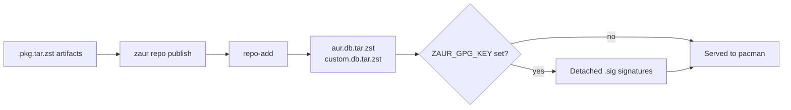

# Repositories

ZAUR publishes pacman-compatible repository databases and serves them over HTTP.
There are two fixed repositories: `aur` (AUR-built packages) and `custom`
(everything else).

## Publish Flow



## Publishing

```bash
# Regenerate repository databases from built packages
zaur repo publish

# List repositories and their package counts
zaur repo list
```

When a repository has no `.pkg.tar.zst` files, `publish` prints "No packages
found" and succeeds without creating a database file. Add and build packages
first.

## Client Configuration

Add the repositories to `/etc/pacman.conf` on client machines:

```ini
[aur]
SigLevel = Optional TrustAll
Server = http://localhost:9004/aur/

[custom]
SigLevel = Optional TrustAll
Server = http://localhost:9004/custom/
```

Refresh with `sudo pacman -Sy`.

## GPG-Signed Databases

Set `ZAUR_GPG_KEY` to a key available in the server's GPG keyring. ZAUR then:

- signs built packages, producing `.sig` files alongside them, and
- detached-signs the generated repository databases (`*.db.tar.zst.sig`).

Use `zaur gpg-init <name> <email>` to create a signing key if you do not already
have one.

With signing enabled, clients can move from `TrustAll` to verified signatures:

```ini
[custom]
SigLevel = Required
Server = https://pkg.example.io
```

After importing and locally signing the key:

```bash
sudo pacman-key --recv-keys <KEY_ID>
sudo pacman-key --lsign-key <KEY_ID>
```

See [Deployment](deployment.md) for serving repositories over HTTPS behind nginx.
