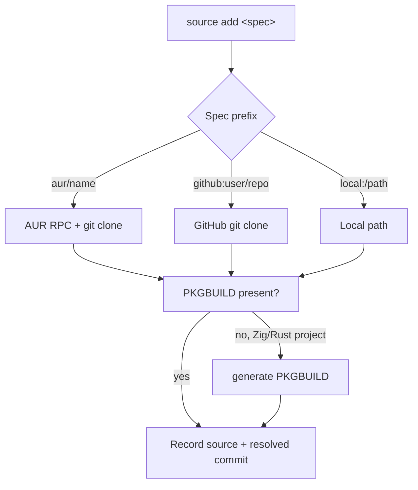

# Sources

A source is anything ZAUR can fetch a PKGBUILD from and build. Sources are
tracked in the database and rebuilt on demand.

## Source Resolution



## Source Specs

| Spec | Example | Notes |
|------|---------|-------|
| `aur/<name>` | `aur/yay` | Resolved via the AUR RPC, then cloned |
| `github:<user>/<repo>` | `github:ghostkellz/zaur` | Cloned over HTTPS |
| `local:<path>` | `local:/srv/pkgs/foo` | Absolute or relative local path |

```bash
zaur source add aur/yay
zaur source add github:user/repo
zaur source add local:/path/to/project

zaur source list
zaur source update yay      # update one source
zaur source update all      # update everything
```

The `add` alias is also accepted: `zaur add aur/yay`.

## Generated PKGBUILDs for Zig and Rust

Projects without a PKGBUILD can have one generated from their build metadata.
`generate` inspects the project directory and emits a PKGBUILD using the Zig or
Rust builder.

```bash
# Generate a PKGBUILD for a project checkout
zaur generate /path/to/project

# Provide an explicit source URL
zaur generate /path/to/project https://github.com/user/repo

# Emit a WebAssembly-targeted PKGBUILD
zaur generate /path/to/project --wasm
```

- Zig projects derive metadata from `build.zig.zon`.
- Rust projects derive metadata from `Cargo.toml`.

Generated PKGBUILDs embed real `sha256sums` when checksum pinning is enabled
(see [Supply-Chain Hardening](../security/supply-chain.md)).

## Building Sources

```bash
zaur build run <package>    # build one
zaur build run all          # build everything
zaur build logs <package>   # view the captured build log
```

Build logs are stored in the database, not on disk. After building, publish the
repository with `zaur repo publish` ([Repositories](repositories.md)).
