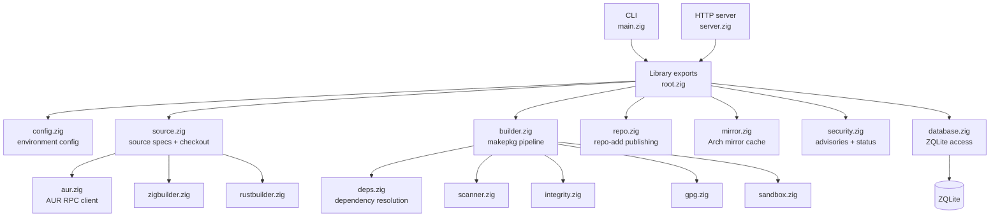
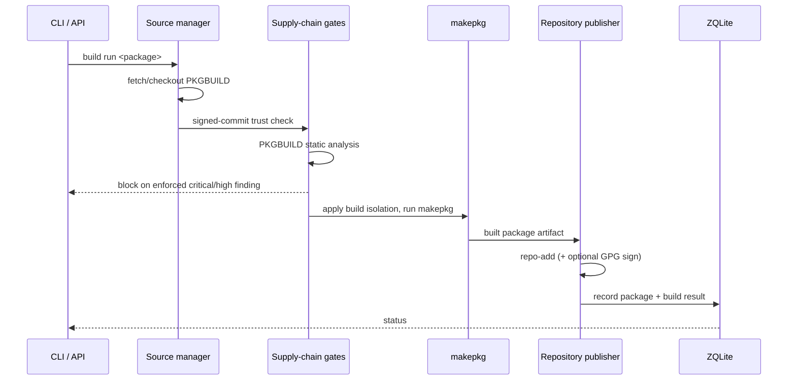
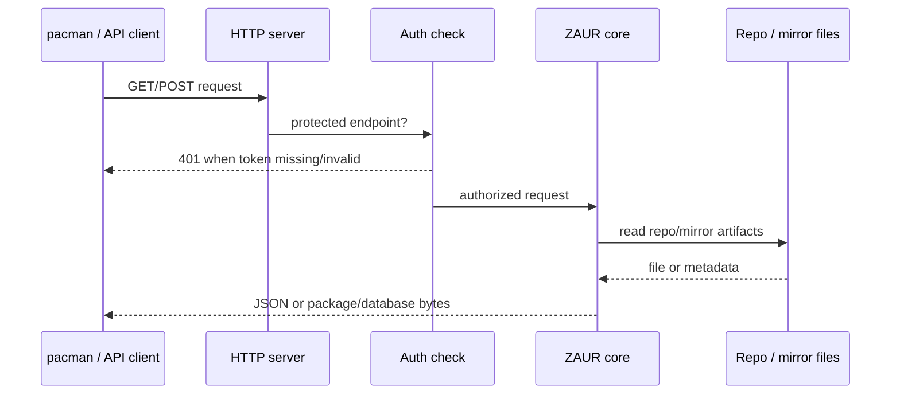
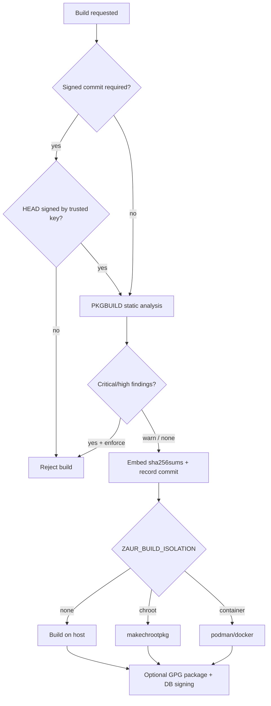

# Architecture

This document describes ZAUR's module layout, the build and request paths, and
the supply-chain gate boundary.

## High-Level Overview



## Source Layout

```text
src/
├── main.zig          # CLI entry point and command dispatch
├── root.zig          # Public library exports
├── config.zig        # Environment-variable configuration
├── database.zig      # ZQLite schema, migrations, metadata, build records
├── source.zig        # Source specs (aur/github/local) and checkout
├── aur.zig           # AUR RPC client
├── builder.zig       # makepkg build pipeline and gate orchestration
├── deps.zig          # Dependency resolution
├── repo.zig          # pacman repository database generation (repo-add)
├── mirror.zig        # Official Arch repository mirroring/caching
├── server.zig        # HTTP server, REST API, and file serving
├── security.zig      # Advisory sync and per-package security status
├── scanner.zig       # PKGBUILD static analysis
├── integrity.zig     # SHA-256 hashing and checksum/ref pinning
├── gpg.zig           # Signed-commit verification and package signing
├── sandbox.zig       # Build isolation backends (chroot/container)
├── zigbuilder.zig    # PKGBUILD generation for Zig projects
├── rustbuilder.zig   # PKGBUILD generation for Rust projects
└── version.zig       # pacman-compatible version comparison (vercmp)
```

## Build Pipeline



## Request Flow



Each accepted TCP connection is handled on its own thread with an independent
`std.Io.Threaded` context; the database is guarded by a process-level mutex.

## Supply-Chain Gate Boundary



## Data Model

ZAUR persists metadata in a single ZQLite database (`zaur.db`). The schema is
created on `init` and evolved through additive migrations. It tracks sources,
packages, build records, trusted GPG keys, PKGBUILD scan findings, source pins,
and synced security advisories. Published repository databases
(`aur.db.tar.zst`, `custom.db.tar.zst`) are generated separately by `repo-add`
and served directly to pacman clients.

## External Tooling

ZAUR shells out to standard Arch tooling rather than reimplementing it:
`makepkg` (builds), `repo-add` (repository databases), `git` (source checkout),
`gpg` (signing/verification), and `tar` (mirror database extraction). See
[Configuration](../guides/configuration.md#external-tool-dependencies) for the
full list.
