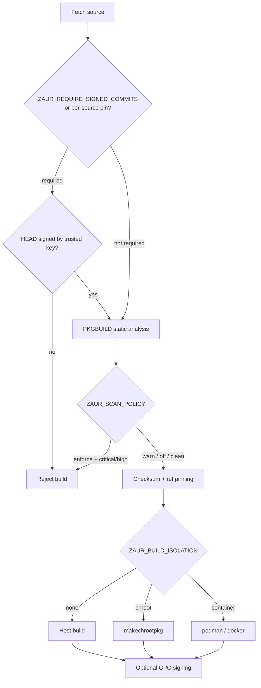

# Supply-Chain Hardening

ZAUR builds third-party code, so it applies a series of gates around the build
pipeline. Each gate is independently configurable and most default to a
non-blocking posture so an unconfigured install still builds.

## Gate Order



## PKGBUILD Static Analysis

The scanner (`scanner.zig`) flags risky patterns in PKGBUILDs and accompanying
scripts: pipe-to-shell, reverse shells, base64/`eval` obfuscation, setuid, writes
to `~/.ssh`, `/etc`, crontab, or systemd units, network fetches inside build
functions, and disabled checksums. Findings are severity-scored
(critical/high/medium/low/info) and persisted.

`ZAUR_SCAN_POLICY` controls the gate:

| Value | Behavior |
|-------|----------|
| `off` | Do not scan |
| `warn` (default) | Scan and log findings, never block |
| `enforce` | Block the build on any critical/high finding before `makepkg` runs |

```bash
zaur security scan-pkgbuild <source>   # analyze on demand
```

Findings are exposed at `GET /api/security/findings` and written by
`POST /api/security/scan-pkgbuild`.

## Checksum and Ref Pinning

With `ZAUR_CHECKSUM_PINNING=true` (default), ZAUR computes SHA-256 of fetched
sources via streaming `std.crypto` (no `sha256sum` subprocess) and embeds real
`sha256sums=(...)` in generated PKGBUILDs, falling back to `SKIP` only when a
download fails. Git sources record their resolved HEAD commit on add/update, and
drift is logged.

```bash
zaur security pin <source> [ref]   # pin to a reproducible ref/commit
zaur security unpin <source>
```

## Signed-Commit Trust

`gpg.zig` parses `git verify-commit` output and distinguishes unsigned, bad
signature, good-but-untrusted, and good-and-trusted states against an allowlist
of trusted key fingerprints.

| Setting | Effect |
|---------|--------|
| `ZAUR_REQUIRE_SIGNED_COMMITS=false` (default) | Verification is advisory |
| `ZAUR_REQUIRE_SIGNED_COMMITS=true` | A source's HEAD must be signed by a trusted key before it builds |

```bash
zaur security verify-commit <source>
zaur security trust-key <fingerprint>
zaur security untrust-key <fingerprint>
zaur security list-keys
```

Key management is also exposed via `GET/POST/DELETE /api/security/keys`.

## Build Isolation

`sandbox.zig` selects how `makepkg` runs. Backends degrade gracefully when the
underlying tooling is absent.

| `ZAUR_BUILD_ISOLATION` | Backend |
|------------------------|---------|
| `none` (default) | Build on the host |
| `chroot` | devtools `makechrootpkg` (`ZAUR_CHROOT_DIR`) |
| `container` | `ZAUR_CONTAINER_RUNTIME` (`podman`/`docker`) with `ZAUR_CONTAINER_IMAGE` |

A single build can override the global setting:

```bash
zaur build run <package> --isolation=chroot
```

## Repository Signing

When `ZAUR_GPG_KEY` is set, ZAUR signs built packages and detached-signs the
published repository databases so pacman clients with `SigLevel = Required` can
verify them. See [Repositories](../guides/repositories.md#gpg-signed-databases).

## Advisory Tracking

ZAUR can sync advisories from the Arch security tracker and report per-package
status. `ZAUR_SECURITY_STALE_DAYS` (default `30`) sets the staleness threshold
and `ZAUR_SECURITY_REQUIRE_SIGNATURES` flags unsigned packages in status output.

```bash
zaur security sync               # pull advisories
zaur security status [package]   # summary or per-package status
zaur security scan [all|package] # recompute status
```

## Configuration Reference

All variables above are summarized in
[Configuration → Security Hardening](../guides/configuration.md#security-hardening).
